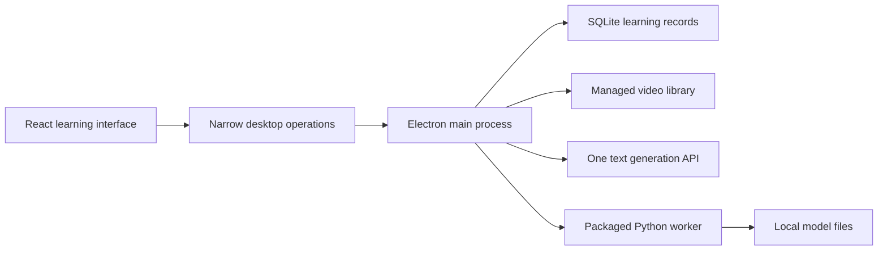

# Windows desktop technical recommendation

> Historical record archived on 2026-10-03. Statements and status fields below describe the original delivery stage. Use [Product Specification](../../../docs/PRODUCT_SPEC.md) and [Project Status](../../../docs/PROJECT_STATUS.md) for current behavior; see [active tasks](../../README.md) for remaining work.

Date: 2026-09-30.
Status: investigated proposal for specification work; no application changes or runtime acceptance are implied.

## Recommended first implementation

| Area | Recommendation | Reason and remaining evidence |
| --- | --- | --- |
| Desktop framework | Electron with the existing React interface, built using Next static export. | Reuses the Node/Python processing path and avoids a second host language. Static export must be checked after moving the current POST endpoints into desktop operations. |
| Text generation | One DeepSeek `deepseek-flash` Responses adapter as the provisional first candidate; prefer the owner's existing usable service if identified. | Documented schema output and low paid rates. Account access and Korean learning quality remain untested. Gemini is the free-tier candidate if eligibility and access are confirmed, not an automatic runtime fallback. |
| Learning storage | Main-process SQLite through builtin `node:sqlite`, plus ordinary managed media/model files. | Fits durable local relationships without a database server or extra native SQLite package. Packaged Windows behavior remains an acceptance gate. |
| Transcription | Retain faster-whisper base CPU/int8 as the first baseline. | Existing implementation already produces Korean text and sentence timings. Validate real-video usability on Windows before adopting an online replacement. |

Supporting investigations: [framework](framework-research.md), [generation API](generation-api-research.md), [storage](storage-research.md). Speech-service candidates remain in [the earlier research](speech-api-options.md); audio generation is not required for the first release.

## Desktop shape and code reuse

The renderer keeps the current media controls, sentence navigation, reveal rules and validation. The desktop host owns import, transcription dispatch, persistence and generation requests. No running Next HTTP server is needed inside the installed app. Next's static export does not retain the current POST transcription/translation routes; those behaviors must move into host operations. [Next static export](https://nextjs.org/docs/app/guides/static-exports)

Current migration locations are `src/listening/Practice.tsx` (browser File/object URL and two HTTP calls), `src/listening/media-server.ts` (Node child process and development-specific Python path), `src/app/api/transcribe/route.ts` and `src/app/api/translate/route.ts` (HTTP glue), and `scripts/media_processor.py` (repository-relative models). This is an adaptation plan, not a wholesale rewrite of listening behavior. Keep `src/listening/reveal.ts` and the processing-result checks reusable.

Expose operations with media/entry/artifact identifiers, rather than arbitrary shell, SQL or filesystem execution. Generated content is text data. Keep keys and provider calls in the host. A secure custom protocol can serve managed media to the existing player, but Windows range/seek behavior needs an actual acceptance test. [Electron security](https://www.electronjs.org/docs/latest/tutorial/security), [Electron protocol](https://www.electronjs.org/docs/latest/api/protocol)

Electron is recommended over Tauri for this checkout because its main process directly hosts the existing Node filesystem and child-process code. Tauri remains viable, but adds Rust, Windows C++ tooling and sidecar configuration while retaining the Python/model distribution problem. Package size and memory have not been measured, so this is a migration-complexity judgment. [Tauri prerequisites](https://v2.tauri.app/start/prerequisites/), [Tauri sidecars](https://v2.tauri.app/develop/sidecar/)

## Generation proposal and its quality boundary

DeepSeek's current official model name is `deepseek-flash`. Its documented peak uncached input/output rates are $0.30/$1.20 per million tokens; there is no established recurring free allowance in the reviewed pricing. Use explicit output/reasoning limits and record actual usage when calls are available; Korean-passage cost has not been measured. [DeepSeek pricing](https://api-docs.deepseek.com/quick_start/pricing/), [thinking controls](https://api-docs.deepseek.com/guides/thinking_mode/)

The Responses reference documents JSON schema output. Several direct page fetches timed out, so this capability was also checked through the official indexed reference; a successful authenticated request with the exact small schema is still needed. Gemini `gemini-3.8-flash` offers free text generation and structured output, but the owner's account eligibility and access are unknown. Google's supported-region list does not list mainland China; the owner's timezone does not establish their actual location. A free offer therefore cannot yet be treated as the delivered default. [DeepSeek Responses](https://api-docs.deepseek.com/api/create-response/), [Gemini pricing](https://ai.google.dev/gemini-api/docs/pricing), [Gemini regions](https://ai.google.dev/gemini-api/docs/available-regions)

For the first request, send selected entry IDs, Korean dictionary forms, contextual Chinese meanings, necessary source sentences and optional topic. Request a title, short Korean sentences, sentence translations, and text parts associated with a selected entry ID where the target word occurs. This permits highlighting conjugated surface forms without requesting fragile numeric offsets. Validate structure, allowed IDs and full target coverage before treating the result as complete. Claimed IDs alone do not prove correct Korean morphology or meaning.

Save the returned artifact and snapshots of its target meanings. Retrying generation creates a new result rather than silently rewriting an existing artifact. Further collection from an artifact keeps its original sentence and artifact source. No speech synthesis, retrieval system or automatic mastery assessment is needed for this learning loop.

Evaluate a small fixed set covering everyday words, inflected verbs/adjectives, ambiguous words with specified senses, and unrelated target words. Check genuine coverage, intended meanings, natural Korean, common non-target vocabulary, Chinese translation and correct highlights. Schema compliance can establish data shape; representative review is needed to establish learning quality. No API call or generated-passage evaluation was performed here.

## Storage and source retention

SQLite stores media metadata, playback segments, vocabulary entries, source occurrences, artifacts and artifact-target relationships. Multiple original sentences may refer to one vocabulary entry; a historical artifact retains the meanings supplied when it was generated. Small transactions can preserve these relationships together. SQLite is explicitly intended for local application storage. [SQLite uses](https://www.sqlite.org/whentouse.html)

Recommend managed copies of imported media for dependable reopening; the cost is additional disk space. Keep media and model weights outside the database and installation directory, with large files in Windows local application-data storage. If a managed file disappears, preserve text and vocabulary and allow re-association. Encrypt the owner's API credential separately with Windows-backed `safeStorage`; keep it out of learning records. [Electron data paths](https://www.electronjs.org/docs/latest/api/app), [credential storage](https://www.electronjs.org/docs/latest/api/safe-storage)

Prefer one main-process SQLite connection and its default journal mode initially. Current Electron release notes establish builtin SQLite support, and the stable release index lists Node 24-based builds. Pin and verify the actual runtime instead of assuming the WSL Node version is the app's Node version. Current Node 24 documentation marks SQLite Stability 1.2, release candidate; package import and persistence checks are required. [Electron builtin fix](https://releases.electronjs.org/release/v36.7.3), [stable releases](https://releases.electronjs.org/), [Node 24 SQLite](https://nodejs.org/docs/latest-v24.x/api/sqlite.html)

## WSL findings and Windows validation boundary

Read-only environment inspection found WSL2, Node 24.18.0, Python 3.12.3 and a `powershell.exe` path. The sandbox initially blocked PowerShell interoperability with `UtilBindVsockAnyPort:309: socket failed 1`. A subsequent approved read-only probe succeeded and found Windows Node 24.19.0 at `C:\Program Files\nodejs\node.exe` and Miniconda Python 3.13.2 at `D:\miniconda\python.exe`. The `py` launcher exists but reports no registered interpreters; this does not negate the working Miniconda Python.

Recommend a separate Windows Python 3.12 environment for the first native worker validation, matching the repository's documented and previously validated baseline. Python 3.13 compatibility has not been tested; do not change the Miniconda base environment. No environment was installed or altered in these probes.

Continue investigation and platform-independent source work in WSL. Before accepting the first Windows package, use a native Windows checkout and Windows dependencies. PyInstaller does not cross-compile the Windows worker from WSL; first validate the existing worker with Windows Python, then package it in one-folder mode with its native DLLs and language data. Installed use should not require a separately installed system Python. [PyInstaller manual](https://pyinstaller.org/en/stable/), [operating modes](https://pyinstaller.org/en/stable/operating-mode.html)

The next runnable evidence should establish:

1. Native Windows transcription on a representative Korean video: elapsed time, transcript accuracy, sentence-boundary completeness, seek/loop behavior and cancellation.
2. One authenticated generation request: schema behavior, target meanings/coverage, common supporting vocabulary, translation, latency and usage.
3. Packaged-app reopening: saved media/transcript, vocabulary and artifacts; source links and historical meanings survive edits/restart.
4. Worker/installer operation on Windows without the development environment, including Chinese/spaced file paths and clean shutdown.

These evidence steps were proposed during the investigation. No dependency installation, framework conversion, model execution, provider billing or installer build was performed in that phase. The current product specification, roadmap and tickets now govern delivery. Windows setup preparation and the deterministic generation adapter are implemented; their live acceptance gates remain open.
