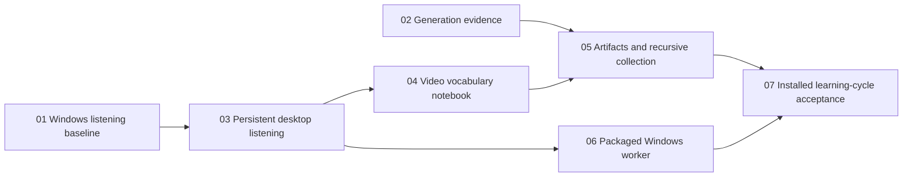

# Desktop Learning Ticket Breakdown

> Historical record archived on 2026-10-03. Statements and status fields below describe the original delivery stage. Use [Product Specification](../../../docs/PRODUCT_SPEC.md) and [Project Status](../../../docs/PROJECT_STATUS.md) for current behavior; see [active tasks](../../README.md) for remaining work.

Status: approved
Confirmation: the owner approved ticket granularity and blocking edges on 2026-09-30; all seven issues are published. Individual issues carry their current triage state.
Updated: 2026-10-01
Parent specification: [Windows Korean Learning Desktop MVP](spec.md).

## Approach

Deliver seven independently verifiable slices. The first two establish end-to-end evidence for the existing Windows listening flow and a small generation runner. They are feasibility gates, not separate schema/API/UI-layer implementation tickets. Subsequent slices deliver observable desktop learning behavior through the application operations interface.

Do not introduce a standalone architecture refactor. Adapt the existing listening and processing logic only where the desktop behavior requires it. Preserve existing processing validation and reveal tests. Each future issue must carry its own behavior, acceptance, verification and prerequisite information so it can be implemented in a fresh session.

## Published issues

- [01: Validate Korean media listening on native Windows](issues/01-windows-listening-baseline.md)
- [02: Validate one vocabulary-to-passage generation path](issues/02-generation-quality-baseline.md)
- [03: Restore a processed video in the desktop application](issues/03-persistent-desktop-listening.md)
- [04: Collect source-linked vocabulary from video](issues/04-video-vocabulary-notebook.md)
- [05: Generate text artifacts and collect the next vocabulary](issues/05-text-artifact-learning-cycle.md)
- [06: Run the packaged Windows worker without system Python](../../desktop-learning/issues/06-packaged-windows-worker.md)
- [07: Accept the installed Windows learning cycle](../../desktop-learning/issues/07-installed-learning-cycle-acceptance.md)

The linked issue files are the single source of acceptance criteria, verification and specification coverage. This index records sequencing and current delivery boundaries.

## Blocking graph

Tickets 01 and 02 have no ticket blockers. Ticket 03 does not depend on generation evidence. After ticket 03, notebook work and packaged-runtime work can proceed independently. Ticket 05 requires both usable generation and saved vocabulary. Final acceptance requires both the learning cycle and packaged runtime.

## Publication boundary

The approved breakdown is published as seven self-contained local issues linked above, in dependency order. Individual issues own acceptance and evidence. Tickets 01 and 02 are complete after owner listening and generation quality acceptance on 2026-10-01. Ticket 03 is complete with native static Electron/SQLite restoration evidence. Ticket 04 is complete with source-linked vocabulary collection and native notebook restoration evidence. Ticket 05 is complete with two real generations, artifact-linked collection and offline restoration. Ticket 06 is unblocked and unstarted; ticket 07 still requires ticket 06.
