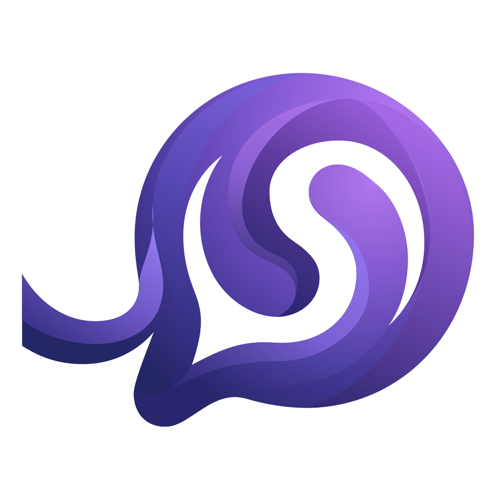

<div align="center">
   
   <h1>Inflow</h1>
</div>

**Acquire language, don't memorize it.**

Inflow is an immersive language learning application built with Next.js. It follows the philosophy of comprehensible input: learners improve by working with language that is meaningful and slightly above their current level.

## Philosophy

Inflow is designed around contextual language acquisition instead of rote memorization.

- **Contextual Learning**: Learn words within story and practice context.
- **AI-Powered Assistance**: Get concise explanations and translations for difficult sentences.
- **Guided Practice**: Practice one sentence at a time with adaptive difficulty.
- **Distraction-Free Study**: Keep the interface focused on reading, vocabulary, and review.

## Features

- **AI Explanations**: Click or submit sentences for concise, context-aware explanations.
- **AI Depiction**: Optionally generate scene images to support comprehension.
- **AI Story Builder**: Create short stories from a vocabulary list.
- **Guided Practice Chat**: Practice one sentence at a time with explanations and translations.
- **Text-to-Speech**: Generate audio for practice sentences and mastered items.
- **Multi-language Support**: Auto-detection across major languages.
- **Progress Tracking**: Manage vocabulary, stories, mastered sentences, and learning progress.

## Tech Stack

- **Framework**: [Next.js 16](https://nextjs.org/) (App Router)
- **Language**: TypeScript + React 19
- **Styling**: [Tailwind CSS 4](https://tailwindcss.com/)
- **UI Components**: [Lucide React](https://lucide.dev/), [Framer Motion](https://www.framer.com/motion/)
- **AI Integration**: OpenAI-compatible chat + image APIs
- **TTS**: PPInfra / MiniMax Speech (server-side)
- **Data Storage**: Drizzle ORM + SQLite (better-sqlite3)

## Getting Started

### Prerequisites

- Node.js 18+
- npm, pnpm, or yarn

### Installation

1. Clone the repository.

   ```bash
   git clone https://github.com/yourusername/inflow.git
   cd inflow
   ```

2. Install dependencies.

   ```bash
   npm install
   ```

3. Configure environment variables.

   Create a `.env.local` file in the root directory:

   ```env
   API_KEY=your_openai_api_key
   BASE_URL=https://api.openai.com/v1

   ENABLE_AI_DEPICT=true
   AI_DEPICT_API_URL=https://api.openai.com/v1/images/generations
   ```

4. Run the development server.

   ```bash
   npm run dev
   ```

5. Open [http://localhost:3000](http://localhost:3000).

## Scripts

- `npm run dev` - start dev server
- `npm run build` - build for production
- `npm run start` - run production server
- `npm run lint` - lint codebase
- `npm run db:generate` - generate Drizzle migration files
- `npm run db:migrate` - apply migrations to SQLite database
- `npm run db:studio` - open Drizzle Studio

## Project Structure

```text
inflow/
├── src/
│   ├── app/                 # Next.js App Router pages and API routes
│   ├── components/          # React components
│   ├── hooks/               # Custom React hooks
│   └── lib/
│       ├── ai/              # OpenAI-compatible client
│       ├── auth/            # NextAuth configuration and permissions
│       ├── db/              # Drizzle schema and database access
│       ├── domain/          # Difficulty engine and domain logic
│       ├── http/            # HTTP utilities
│       ├── media/           # Image and TTS services
│       └── types/           # Shared TypeScript types
├── drizzle/                 # Drizzle Kit migration files
├── data/                    # SQLite database files (runtime, ignored)
├── public/uploads/          # Generated images and audio
├── next.config.ts
├── drizzle.config.ts
└── tsconfig.json
```

## Storage Notes

- Application data such as users, progress, vocabulary, stories, and chat history is stored in SQLite under `data/`.
- Generated media such as images and audio is stored in `public/uploads/`.

## License

This project is licensed under the Apache License 2.0. See the LICENSE file for details.
